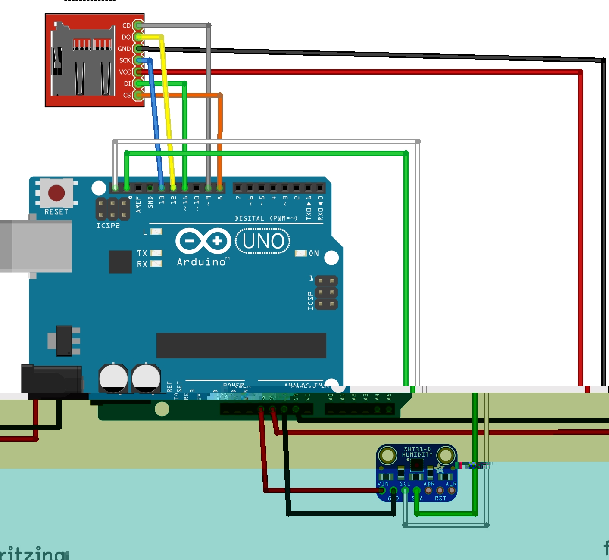
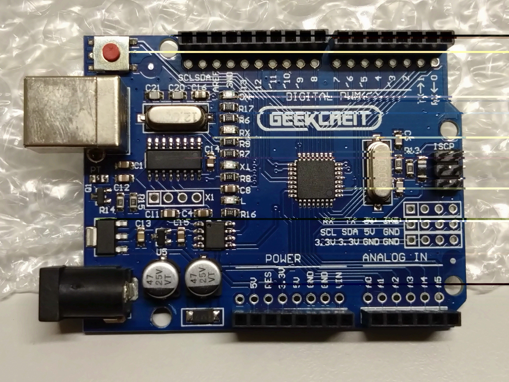

# Envirotech_2025
Directory created for the course: "Envirotech" - BIDR BGU 2025 spring semester. 

## Midterm Project
### About:
* Goal: To build (my first) environmental monitoring system, using open-source hardware.
* Start date: ± 27 April, 2025 (earlier versions already existed). 
* End date: 18 May, 2025 -> project submission. 

### Contents:
* `Report-Gill_Tsemach` - Project report in Word and PDF formats 
* `Temp-RH-CO2_midterm.jpg` - Connection diagram
* `Bill_of_materials.md` - Bill of materials table in Mark-Down format, also exists in the word file.
* `envirotech_midterm.ino` - Arduino code used to operate the sensor
* `midterm.csv` - Raw data output from sensor
* `Graph_generation.ipynb` - Jupyter Notebook file for generating the graphs (Python)
* `Output` - Result graphs
* `Photos` - Folder containing photos and additional ones
* `test_codes` - Supplimentary Arduino code for testing SD card

---

 

### System:

### Connection Diagram: 

### Microcontroller Board:

### Bill of Materials:

---

 

### Full report:

