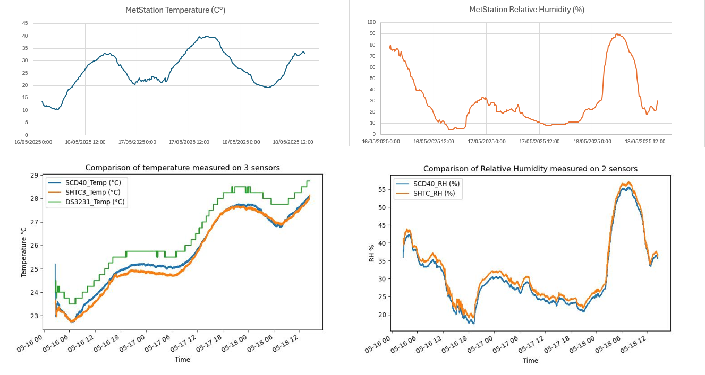

2025-05-19

* The folder "Validation_IMS" was added after the project was submitted, out of curiosity.
* The folder contains data from Israel Meteorological Service (IMS), measured at the Sde-Boker meteorological station. 
* Link to site: https://ims.gov.il/en/node/233
* For quick examination, the graphs at `Quick_visual_validation.png` are presented. 
* The data extracted from IMS is in the `IMSdata_SdeBoker...csv` file, with the relevant time span. 
* **NOTE:** 
  * Sde-Boker is located near where the project's system was placed (Midreshet Ben-Gurion, The Albert Katz International School student dormitories). There are physical-geographical differences between the two locations that might affect meteorological variables, such as wind speed and slight other differences. 
  * A reminder that the project's system was placed indoors. 

---

